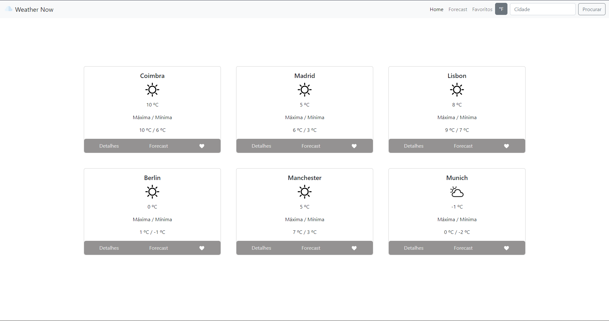
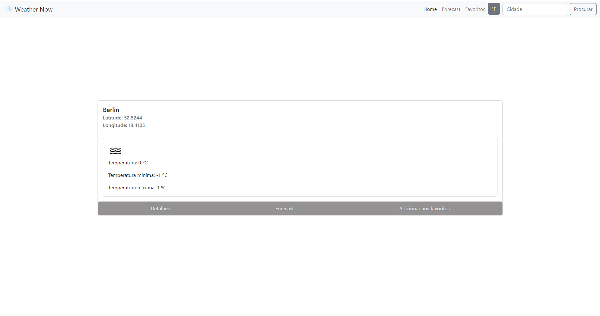
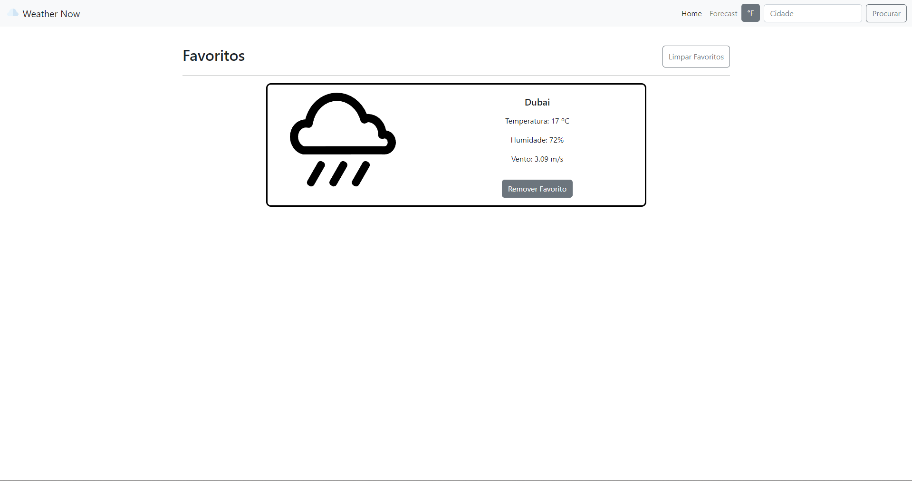
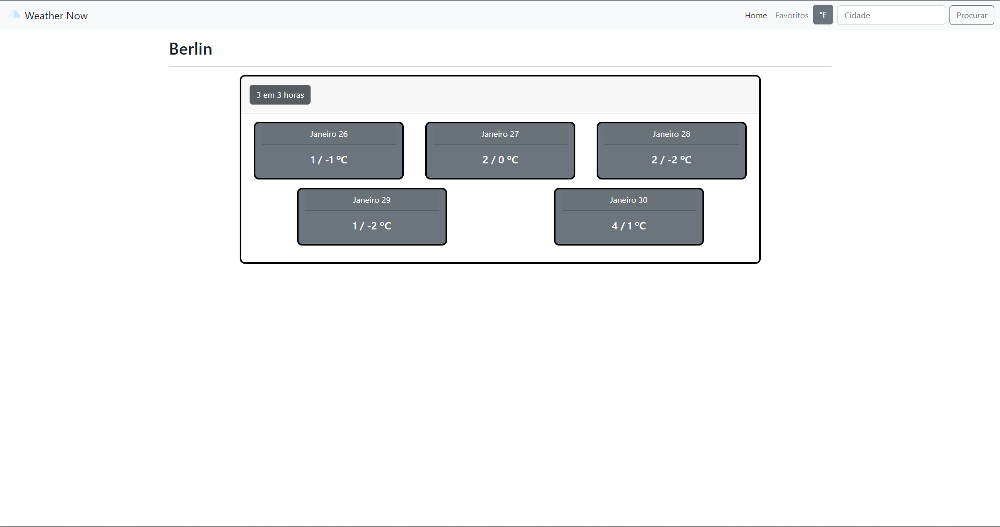

      
      <h1>Weather Now</h1>

Weather Now is a simple weather website built on top of the [OpenWeatherMap API](https://openweathermap.org/api) for our final Web Development project.

 

      <h3>Screenshots</h3>
      
       
      
       
      
       
      

 

### Contribuiting guidelines for group members

To contribute to the project, follow the developer notes on contribuiting [here](CONTRIBUITING.md).

### License

This project is licensed under the MIT License - check out the [LICENSE](LICENSE.md) file for details.